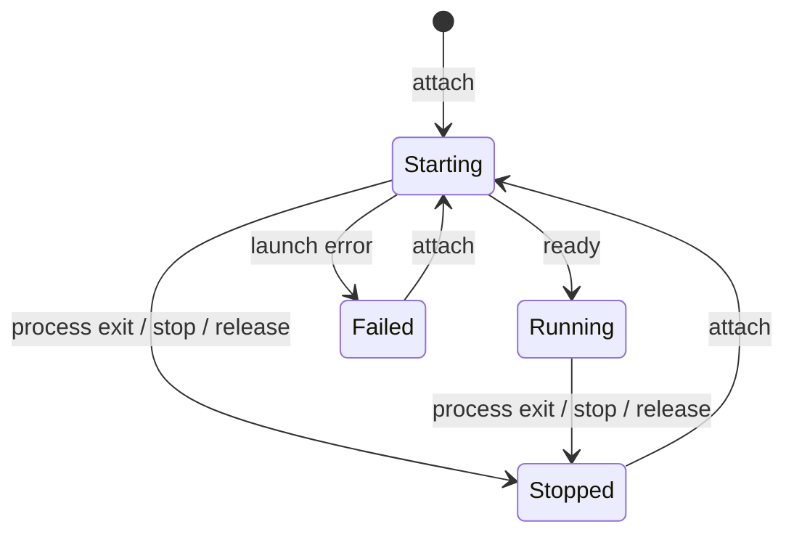
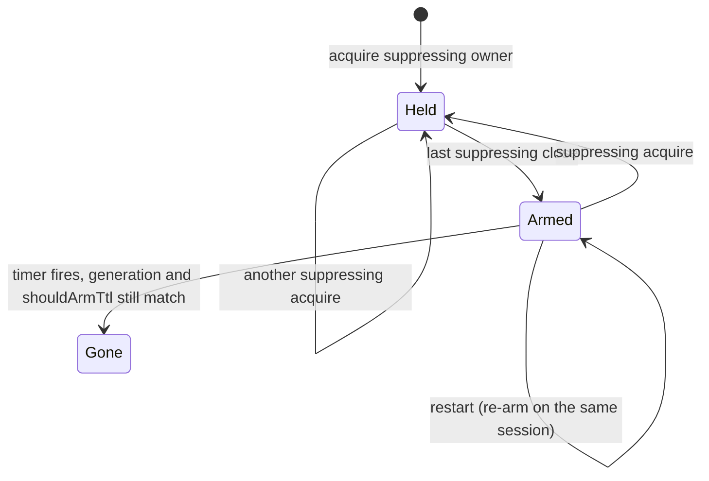
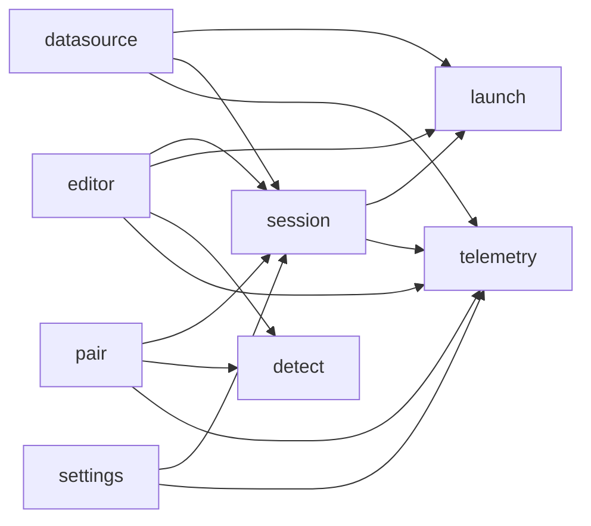

# Architecture

PyCharm starts one local marimo server for each notebook. The editor shows the notebook in JCEF.

The packages divide this work. `detect` and `launch` work with files and processes. `session` owns the shared lifetime of a notebook. `editor` and `pair` hold leases on that lifetime. `settings` and `telemetry` support these packages.

Gradle commands are in [AGENTS.md](AGENTS.md). The contributor procedure is in [CONTRIBUTING.md](CONTRIBUTING.md).

## Layers

| Layer | Role |
|---|---|
| `detect/` | Reads the file header to find whether a `.py` file is a marimo notebook. The result is cached. |
| `datasource/` | Maps IDE Database Tools connections to launch environment variables: consent store, family table, `JB_*` naming, `JB_DATASOURCES` manifest, staleness. Loads its IDE-facing parts only when the Database Tools plugin is present. |
| `launch/` | Selects uv or the SDK. Builds the CLI. Supervises the process. Owns `NotebookLifecycle`. |
| `session/` | Holds one `NotebookSession` per file. The session has leases, a single-flight start, a TTL, tokens, and an environment probe. The session starts processes through `launch/`. |
| `editor/` | Holds file editors, JCEF views, the Sessions tool window, and session actions. Owns `EDITOR_TAB` leases. |
| `pair/` | Starts a harness terminal. Copies the pair prompt. Owns `PAIR_TERMINAL` and `PAIR_PROMPT` leases. |
| `settings/`, `telemetry/` | Shows the preferences UI. Sends events that obey consent. |

The UI reads session state with `peek`. A start or a stop of a process uses a lease (`readyUrl`, `restart`, `stop`).

## Lease contract

`NotebookSessionManager` is a project service. `acquire(file, owner)` returns a `NotebookSessionLease`. When the session does not exist, `acquire` creates it. `close()` removes that owner. A second `close()` does nothing. `peek` and `status` do not create a session.

When no live URL exists, `readyUrl()` starts the server. When a start already runs, `readyUrl()` returns that future. `restart()` and `stop()` use the same session. `leaseIfPresent` is a handle that does not own the session. The UI uses this handle. This handle does not hold the TTL.

`EDITOR_TAB` and `PAIR_TERMINAL` suppress the TTL while their count is more than zero. `PAIR_PROMPT` is temporary. `PAIR_PROMPT` does not suppress the TTL.

When no owner that suppresses the TTL remains, the manager starts a background TTL from `SessionSettings`. When no lease that suppresses the TTL exists, `stop` removes the session. When an editor or a pair terminal still holds a lease, `stop` keeps a stopped panel. That panel can restart.

The identity of a session is `SessionId` and the notebook `VirtualFile`. The file URL changes with a rename. Callers do not count tabs. Callers do not keep process handles.

## Lifecycle

`NotebookLifecycle` is the only writer of `MarimoNotebookState`. The states are:

- Starting
- Running (url)
- Stopped (Deliberate or Unexpected)
- Failed

`attach` takes a new handle. `release` and `stop` end that handle. Each `attach`, `release`, or `stop` increases the launch generation. When the generation of a callback is not current, the callback is a no-op.

## TTL

`onTtlExpired` makes sure that the generation, `shouldArmTtl`, and `sessions.remove` still match, under the session lock. As a result, a cancelled timer or a new attach does not dispose the session a second time.

## Generation invariants

1. **View navigation:** When generation N is stale, a UI continuation that is bound to N is a no-op.
2. **Lifecycle:** When generation N is stale, a process callback that is bound to N is a no-op.
3. **TTL:** When a TTL timer fires, the handler runs under the session lock. The handler makes sure that the generation, the lease count, and the removal still match.

A JCEF load error must match the origin of the current navigation. When the navigation set a URL, the error must match that URL also. As a result, Restart does not show a failure from the previous server.

## plugin.xml

These types are `@Service`. They are not in `plugin.xml`:

- `NotebookSessionManager`
- `SessionSettings`
- `MarimoTelemetry`

`MarimoPairPromptService` is an object. It is also not in `plugin.xml`.

| Kind | id / type | Implementation |
|---|---|---|
| File editor | notebook | `MarimoFileEditorProvider` |
| File editor | source | `MarimoSourceEditorProvider` |
| Icon | (none) | `MarimoFileIconProvider` |
| Tool window | Marimo Sessions | `MarimoSessionsToolWindowFactory` |
| Configurable | `io.marimo.notebook.telemetry.settings` | `MarimoSettingsConfigurable` |
| Template | marimo Notebook | internal file template |
| Notifications | Marimo | balloon group |
| Action | `Marimo.NewNotebook` | `CreateMarimoNotebookAction` |
| Action | `Marimo.OpenAsPythonFile` | `OpenAsPythonFileAction` |
| Action | `Marimo.RunInSandbox` | `RunInSandboxAction` |
| Group | `Marimo.Session` | `MarimoSessionActionGroup` (Open / Restart / Stop) |
| Group | `Marimo.Pair` | `MarimoPairActionGroup` |

## Package dependencies

This diagram shows the permitted imports between plugin packages. `PackageDependencyTest` makes sure that these rules hold:

- `detect` does not import other plugin packages.
- `datasource` does not import `editor` or `pair`.
- `launch` does not import `session`, `editor`, or `pair`.
- `session` does not import `editor` or `pair`.

An arrow is an import. `launch` does not import `session`. `detect` has no plugin-internal imports.

## Threading

Changes to Swing run on the EDT. `Disposer.dispose` of UI objects also runs on the EDT. When the caller is not on the EDT, the code uses `invokeLater`.

`NotebookLifecycle` has a lock. The session maps have a lock. Listeners can run on the thread that publishes a transition.

These tasks run on pooled or scheduled threads (`AppExecutorUtil`):

- process I/O
- readiness HTTP
- environment probes
- package installs
- token-file writes
- TTL

These threads do not change Swing. `readyUrl()` can start work on a pooled thread. The future can complete on any thread. Then the view shows the result on the EDT.

`peek` and action `update` have no side effects. The EDT can call them. Probes and `pip`/`uv` subprocesses run off the EDT. The pair prompt is an EDT callback. The callback is a child disposable of the project. When the project closes, the callback expires.
