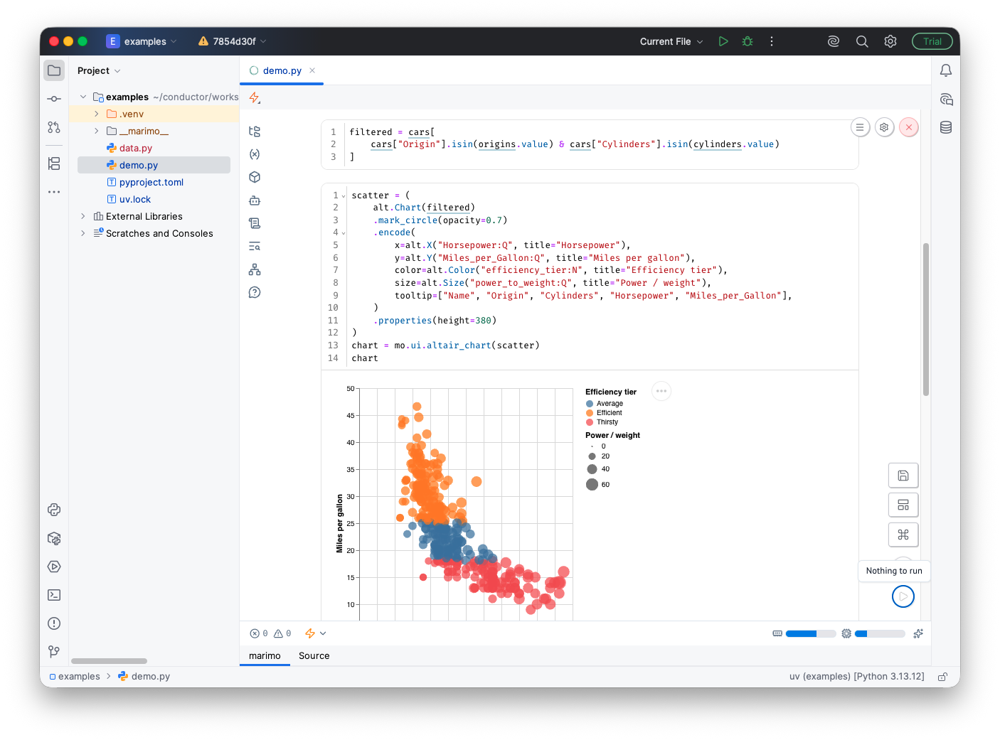

[](https://plugins.jetbrains.com/plugin/32416-marimo)

# marimo for PyCharm

Open and run [marimo](https://marimo.io) notebooks directly in PyCharm.

marimo notebooks are stored as plain Python files, and this plugin lets you open them in a full marimo editor without leaving your IDE — reactive cells, interactive UI widgets, package management, and more, all in a dedicated notebook tab.



## Features

- **Open `.py` marimo notebooks as notebooks** — files that use marimo open in an interactive editor instead of a plain text view. Non-marimo files keep the normal Python editor.
- **Full marimo experience** — reactive execution, `mo.ui` widgets, SQL cells, the variables and dependency panels, and the built-in package manager all work as they do in marimo.
- **Runs on your interpreter** — the plugin launches marimo on your configured project interpreter, and offers to install it when it's missing.
- **Start in a sandbox** — run a notebook in an isolated [uv](https://docs.astral.sh/uv/) environment.
- **Pair with AI** — start a supported terminal AI harness for a notebook, or copy its pairing prompt.
- **IDE database connections in notebooks** — share PyCharm Database Tools sources with a selected notebook. marimo 0.23.16+ can suggest the default source for each database family as a Quick Add SQL cell. The plugin reads passwords from the IDE credential store only at launch. The notebook process can read shared passwords, but the plugin does not write them to project files or logs. If a shared source changes, the session card marks the running notebook stale until restart.
- **Clear recovery when a notebook can't start** — Retry, Install, or Open as Python File instead of a stack trace.
- **New → marimo Notebook** — a file template and notebook icon for marimo `.py` files, plus "Open as Python File" to view the raw source.
- **Stays in sync** — edits made to a notebook's source in another editor reload the marimo editor automatically, and the editor theme follows the IDE's light/dark theme.
- **Git-friendly** — notebooks stay as regular `.py` files, so diffs and reviews work normally.

## Requirements

- PyCharm 2026.1 or later (Community or Professional)
- A project interpreter with marimo installed — the plugin runs marimo on your configured interpreter,
  and offers to install it for you if it's missing
- [uv](https://docs.astral.sh/uv/) (optional) — only needed to run a notebook in an isolated sandbox
- PyCharm Professional with Database Tools (optional) — only needed to share IDE data sources

## Getting started

1. Install the plugin.
2. Open a folder containing a marimo notebook.
3. Open the notebook `.py` file — it loads in the marimo editor.
4. Edit and run cells; results update reactively.

A marimo notebook is a Python file that looks roughly like this:

```python
import marimo

app = marimo.App()

@app.cell
def _():
    import marimo as mo
    return (mo,)
```

If a `.py` file isn't a marimo notebook, it opens in the normal Python editor as usual.

## Development

You need JDK 21 or later; Gradle is provided through the wrapper. To launch a
sandboxed PyCharm instance with the plugin loaded, run:

```bash
./gradlew runIde
```

See the [common command reference](AGENTS.md#common-commands) and the full
[contributor guide](CONTRIBUTING.md) for setup, testing, and local marimo
development.

## Feedback

Bug reports and ideas are welcome via the issue tracker. Interest in marimo support for PyCharm is also tracked upstream at [JetBrains PY-78283](https://youtrack.jetbrains.com/issue/PY-78283/Add-UI-support-for-Marimo).

---
Plugin based on the [IntelliJ Platform Plugin Template][template].

[template]: https://github.com/JetBrains/intellij-platform-plugin-template
